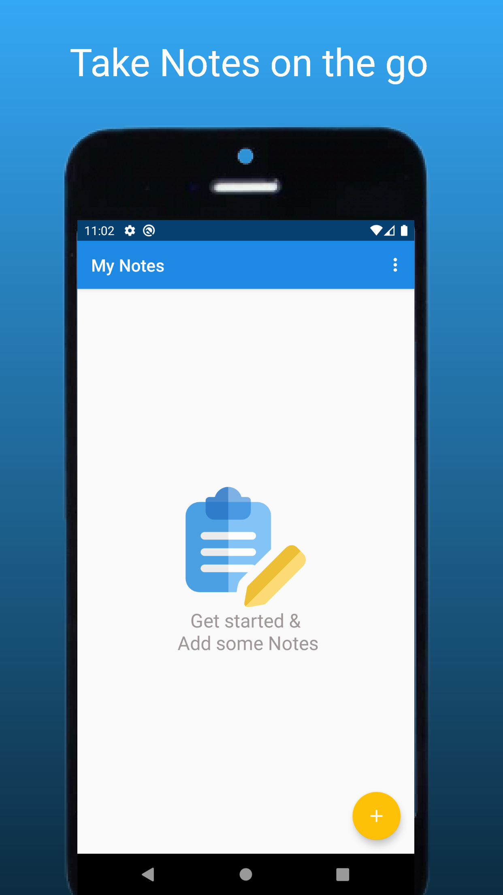
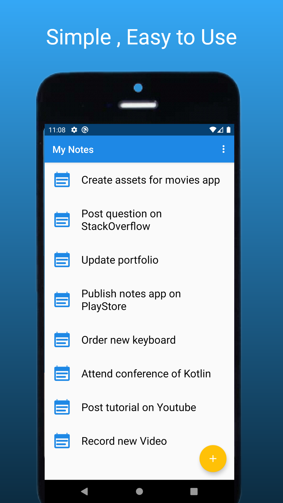
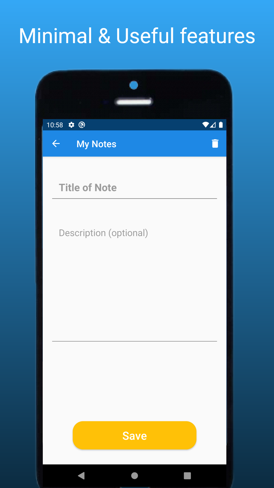

# Simple Notes App

<h2 style="">Description</h2>

<b>My Notes App</b>  is a simple & efficient solution for your Note storing needs 

___
## USP
##### Most phones nowadays come with built-in Notes App. But it is loaded with tons of features that you barely use.</h6>
##### That's why I have designed this simple yet efficient tool specially for you.
___

## Contact me:
Portfolio Website: [adarsh45.github.io](https://adarsh45.github.io)
Email: [shete.adarsh@gmail.com](shete.adarsh@gmail.com)
LinkedIn: [linkedin.com/adarsh45](https://www.linkedin.com/in/adarsh45/)